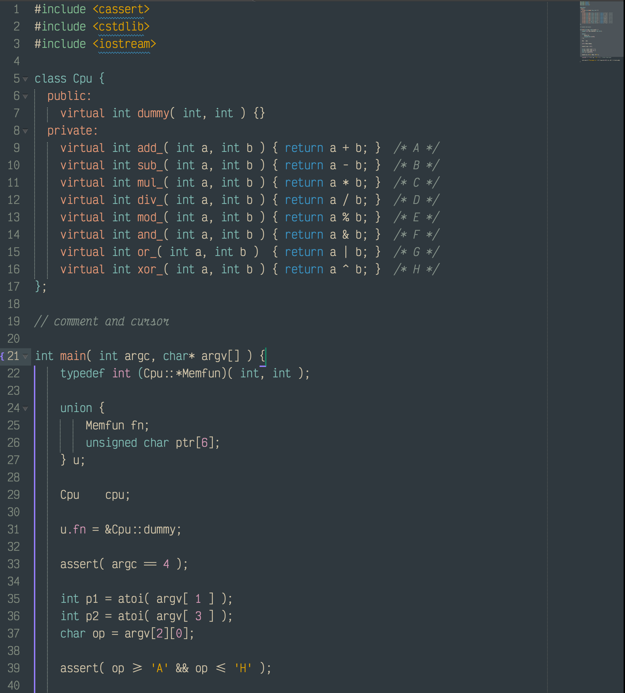

# ArcticForest-Dark

This started for me when I got really into [@sainnhe](https://github.com/sainnhe)'s [Everforest Dark theme](https://github.com/sainnhe/everforest-vscode). I use Visual Studio Code for certain applications, but I spend most of my time in Sublime Text, and I found the available options lacking. As a result, I used this [code theme converter](https://github.com/tobiastimm/code-theme-converter) to convert sainnhe's vscode theme (Dark Medium Material style) to Sublime and... spent the next week tweaking things obsessively. As a recovering [Solarized Dark](https://ethanschoonover.com/solarized/) addict, I personally favor the cooler/bluer side of the spectrum. Hence, we have ***ArcticForest Dark***.

I'll also include some screenshots and the theme files for my iTerm2 and Visual Studio Code that is modified very marginally for Sainnhe's--e.g., subtle blue-gray pane dividers and some color swaps.

## Screenshots

#### Sublime Text

<!--  -->

<!--  -->

#### iTerm2

<!--  -->

#### Visual Studio Code

<!--  -->

<!--  -->

## Installation (<kbd>To Do</kbd>)

## License

[MIT License](https://github.com/mjs271/ArcticForest-Dark/blob/main/LICENSE)
